# 📱 PhoneFront

<div align="center">

**Your Trusted Smartphone Guide - Discover, Compare, and Explore the Latest Mobile Technology**

[](https://nextjs.org/)
[](https://www.typescriptlang.org/)
[](https://www.contentstack.com/)
[](https://www.contentstack.com/)
[](https://jestjs.io/)

[Features](#-features) • [Architecture](#-architecture) • [Getting Started](#-getting-started) • [Documentation](#-documentation) • [Contributing](#-contributing)

</div>

---

## 📋 Table of Contents

- [Overview](#-overview)
- [Features](#-features)
- [Architecture](#-architecture)
- [Technology Stack](#-technology-stack)
- [Getting Started](#-getting-started)
- [Project Structure](#-project-structure)
- [API Documentation](#-api-documentation)
- [Testing](#-testing)
- [Deployment](#-deployment)
- [Documentation](#-documentation)
- [Contributing](#-contributing)
- [License](#-license)

---

## 🎯 Overview

**PhoneFront** is a modern, full-stack web application designed for smartphone enthusiasts and consumers. It provides a comprehensive platform for discovering, comparing, and learning about the latest smartphones with detailed specifications, expert reviews, tech news, and manufacturer information.

### ✨ Key Highlights

- 🔍 **Advanced Search & Filtering** - Find phones by brand, price, OS, features, and more
- 🤖 **AI-Powered Personalization** - Content tailored to your preferences using ContentStack Personalize
- 📊 **Comprehensive Data** - Detailed specs, reviews, news, and company insights
- 📱 **Mobile-First Design** - Beautiful, responsive interface that works on all devices
- ⚡ **Lightning Fast** - Optimized performance with edge computing and CDN
- ♿ **Accessible** - WCAG 2.1 AA compliant for all users

---

## 🚀 Features

### Core Features

| Feature | Description |
|---------|-------------|
| **📱 Phone Discovery** | Browse extensive smartphone catalog with advanced filtering options |
| **🔎 Smart Filtering** | Filter by brand, price range, OS, features, specifications, and more |
| **⭐ Expert Reviews** | Comprehensive reviews with ratings, pros/cons, and detailed analysis |
| **📰 Tech News** | Latest smartphone news and industry updates |
| **🏢 Company Profiles** | Detailed information about smartphone manufacturers |
| **🎯 Personalized Content** | AI-powered content recommendations based on user behavior |

### Advanced Features

| Feature | Benefit |
|---------|---------|
| **Edge Personalization** | Sub-100ms personalization at the edge for instant user experience |
| **Real-time Filtering** | Dynamic price range filters with instant updates |
| **SEO Optimized** | Server-side rendering for better search engine visibility |
| **Analytics Integration** | Lytics Analytics for comprehensive tracking |
| **Feedback System** | User feedback collection for continuous improvement |

---

## 🏗️ Architecture

PhoneFront is built on a modern, scalable architecture leveraging Next.js 14, ContentStack CMS, and edge computing for optimal performance.

### System Architecture Diagram

📐 **[View Interactive Architecture Diagram](https://app.eraser.io/workspace/4oRddEmEnNb1oqVzXP5s?origin=share&elements=ENQyBd9Gwo-pTKIYnr21HA)**

```mermaid
graph TB
    subgraph "👤 User Layer"
        USER[Web & Mobile Browsers]
    end
    
    subgraph "⚡ Edge Layer"
        EDGE[ContentStack Launch Edge Function<br/>Personalization Engine]
    end
    
    subgraph "🚀 Application Layer"
        NEXT[Next.js 14<br/>Pages & API Routes]
    end
    
    subgraph "📝 ContentStack Ecosystem"
        CMS[ContentStack CMS<br/>Content Management]
        PERSONALIZE[Personalize SDK<br/>AI Personalization]
        CDN[Global CDN<br/>Content Delivery]
    end
    
    subgraph "📊 Analytics Layer"
        LYTICS[Lytics Analytics<br/>User Behavior]
        CONTENTSTACK_ANALYTICS[ContentStack Analytics<br/>Performance]
    end
    
    USER -->|1. Request| EDGE
    EDGE -->|2. Personalize| NEXT
    NEXT -->|3. Fetch| CMS
    CMS -->|4. Content| NEXT
    NEXT -->|5. Response| EDGE
    EDGE -->|6. Personalized| USER
    
    USER -.->|Tracking| LYTICS
    EDGE -.->|Metrics| CONTENTSTACK_ANALYTICS
```



### Architecture Highlights

- **ContentStack Launch Platform**: Complete hosting and edge computing platform
- **Edge Computing**: Personalization happens at the edge for ultra-low latency
- **Headless CMS**: ContentStack provides flexible, scalable content management
- **Server-Side Rendering**: Next.js SSR for SEO and performance
- **API-First Design**: RESTful APIs for all data operations
- **CDN Delivery**: Global content delivery network for fast load times

---

## 💻 Technology Stack

### Frontend & Framework

| Technology | Version | Purpose |
|------------|---------|---------|
| [Next.js](https://nextjs.org/) | 14.2.16 | React framework with App Router |
| [React](https://react.dev/) | 18.x | UI library |
| [TypeScript](https://www.typescriptlang.org/) | 5.x | Type safety |
| [Tailwind CSS](https://tailwindcss.com/) | 4.1.9 | Utility-first CSS |

### UI Components

| Library | Purpose |
|---------|---------|
| [Radix UI](https://www.radix-ui.com/) | Accessible, unstyled components |
| [Lucide Icons](https://lucide.dev/) | Beautiful icon library |
| [Geist Font](https://vercel.com/font) | Modern typeface (Next.js default) |

### Data & State Management

| Technology | Purpose |
|------------|---------|
| [SWR](https://swr.vercel.app/) | Data fetching & caching |
| [React Hook Form](https://react-hook-form.com/) | Form state management |
| [Zod](https://zod.dev/) | Schema validation |

### Content Management

| Service | Purpose |
|---------|---------|
| [ContentStack](https://www.contentstack.com/) | Headless CMS |
| [ContentStack Personalize](https://www.contentstack.com/personalization) | AI-powered personalization |
| ContentStack Delivery SDK | Content fetching |

### Testing & Quality

| Tool | Purpose |
|------|---------|
| [Jest](https://jestjs.io/) | Testing framework |
| [Testing Library](https://testing-library.com/) | Component testing |
| [MSW](https://mswjs.io/) | API mocking |

### Deployment & Analytics

| Service | Purpose |
|---------|---------|
| [ContentStack Launch](https://www.contentstack.com/) | Hosting & Edge Functions Platform |
| [Lytics](https://www.lytics.com/) | User behavior analytics |

---

## 🚀 Getting Started

### Prerequisites

- **Node.js** 18.x or higher
- **npm** or **pnpm** or **yarn**
- **ContentStack** account (for CMS access)
- **Git** for version control

### Installation

1. **Clone the repository**
   ```bash
   git clone https://github.com/your-username/phonefront.git
   cd phonefront
   ```

2. **Install dependencies**
   ```bash
   npm install
   # or
   pnpm install
   # or
   yarn install
   ```

3. **Set up environment variables**
   
   Create a `.env.local` file in the root directory:
   ```env
   # ContentStack Configuration
   NEXT_PUBLIC_CONTENTSTACK_API_KEY=your_api_key
   NEXT_PUBLIC_CONTENTSTACK_DELIVERY_TOKEN=your_delivery_token
   NEXT_PUBLIC_CONTENTSTACK_ENVIRONMENT=your_environment
   NEXT_PUBLIC_CONTENTSTACK_REGION=us
   NEXT_PUBLIC_CONTENTSTACK_MANAGEMENT_TOKEN=your_management_token
   
   # Base URL
   NEXT_PUBLIC_BASE_URL=http://localhost:3000
   ```

4. **Run the development server**
   ```bash
   npm run dev
   # or
   pnpm dev
   # or
   yarn dev
   ```

5. **Open your browser**
   
   Navigate to [http://localhost:3000](http://localhost:3000)

### Build for Production

```bash
npm run build
npm run start
```

### Run Tests

```bash
# Run tests in watch mode
npm run test

# Run tests once
npm run test:ci

# Run tests with coverage
npm run test:coverage
```

---

## 📁 Project Structure

```
phonefront/
├── 📁 app/                          # Next.js App Router
│   ├── 📁 api/                      # API Routes
│   │   ├── phones/                  # Phone data endpoints
│   │   ├── news/                    # News endpoints
│   │   ├── reviews/                 # Review endpoints
│   │   ├── companies/               # Company endpoints
│   │   ├── feedback/                # Feedback submission
│   │   └── ...
│   ├── 📁 phones/                   # Phone pages
│   ├── 📁 news/                     # News pages
│   ├── 📁 reviews/                  # Review pages
│   ├── 📁 companies/                # Company pages
│   ├── layout.tsx                   # Root layout
│   └── page.tsx                     # Home page
│
├── 📁 components/                    # React Components
│   ├── 📁 ui/                       # Reusable UI components
│   ├── 📁 home/                     # Home page components
│   ├── 📁 phones/                   # Phone-related components
│   ├── 📁 news/                     # News components
│   ├── 📁 reviews/                  # Review components
│   └── ...
│
├── 📁 lib/                          # Utility Libraries
│   ├── contentstack-delivery.ts     # ContentStack SDK
│   ├── contentstack-management.ts   # Management SDK
│   ├── contentstack-personalize.ts # Personalization SDK
│   ├── fetcher.ts                   # API utilities
│   └── types.ts                     # TypeScript types
│
├── 📁 hooks/                         # Custom React Hooks
│   ├── use-impressions.ts           # Impression tracking
│   └── use-mobile.ts                # Mobile detection
│
├── 📁 functions/                     # Edge Functions
│   └── [proxy].edge.js               # Personalization proxy
│
├── 📁 public/                       # Static Assets
├── 📁 test-utils/                   # Test utilities
└── 📄 Configuration Files
```

---

## 📚 API Documentation

### Core API Endpoints

| Endpoint | Method | Description | Parameters |
|----------|--------|-------------|------------|
| `/api/phones` | GET | Fetch phones with filtering | `page`, `pageSize`, `sortBy`, `companies`, `os`, `features`, `priceRange` |
| `/api/news` | GET | Fetch news articles | `page`, `pageSize`, `sortBy`, `categories` |
| `/api/reviews` | GET | Fetch phone reviews | `page`, `pageSize`, `sortBy`, `phoneId` |
| `/api/companies` | GET | Fetch company data | `page`, `pageSize` |
| `/api/price-filters` | GET | Get price filter ranges | - |
| `/api/feedback` | POST | Submit user feedback | `title`, `email`, `message`, `feedback_type` |
| `/api/home_page` | GET | Get homepage content | - |
| `/api/header` | GET | Get header navigation | - |
| `/api/footer` | GET | Get footer content | - |

### Example API Request

```typescript
// Fetch phones with filters
GET /api/phones?page=1&pageSize=12&companies=apple,samsung&priceRange=500-1000

// Response
{
  "items": [...],
  "page": 1,
  "pageSize": 12,
  "total": 50,
  "personalized": true,
  "variantParam": "exp_123_var_456"
}
```

### Response Format

```typescript
interface ApiResponse<T> {
  items: T[];
  page: number;
  pageSize: number;
  total: number;
  personalized: boolean;
  variantParam?: string;
}
```

---

## 🧪 Testing

PhoneFront uses Jest and React Testing Library for comprehensive test coverage.

### Test Structure

```
__tests__/
├── app/                    # Page component tests
├── components/             # Component tests
├── lib/                    # Utility function tests
└── hooks/                 # Hook tests
```

### Running Tests

```bash
# Watch mode
npm run test

# Single run
npm run test:ci

# With coverage
npm run test:coverage
```

### Test Coverage Goals

| Metric | Target | Current |
|--------|--------|---------|
| Statements | 90% | ~42% |
| Branches | 85% | ~36% |
| Functions | 90% | ~36% |
| Lines | 90% | ~42% |

> 💡 See [docs/TESTING_ROADMAP.md](./docs/TESTING_ROADMAP.md) for detailed testing strategy

---

## 🚢 Deployment

### Deploy to ContentStack Launch Platform

1. **Set up ContentStack Launch**
   
   - Create a ContentStack Launch project
   - Connect your repository to ContentStack Launch
   - Configure build settings for Next.js

2. **Configure environment variables**
   
   Add all ContentStack credentials in Launch platform:
   - `NEXT_PUBLIC_CONTENTSTACK_API_KEY`
   - `NEXT_PUBLIC_CONTENTSTACK_DELIVERY_TOKEN`
   - `NEXT_PUBLIC_CONTENTSTACK_ENVIRONMENT`
   - `NEXT_PUBLIC_CONTENTSTACK_REGION`
   - `NEXT_PUBLIC_CONTENTSTACK_PERSONALIZE_PROJECT_UID`
   - `NEXT_PUBLIC_CONTENTSTACK_PERSONALIZE_EDGE_API_URL`

3. **Deploy**
   
   - Push to main branch for automatic deployment
   - ContentStack Launch handles build and deployment
   - Edge function is automatically deployed from `functions/[proxy].edge.js`

### Edge Function Configuration

The personalization edge function (`functions/[proxy].edge.js`) runs on ContentStack Launch Platform's edge network, providing global personalization at the edge.

---

## 📖 Documentation

### Project Documentation

- 📐 **[Architecture Diagram](https://app.eraser.io/workspace/4oRddEmEnNb1oqVzXP5s?origin=share&elements=ENQyBd9Gwo-pTKIYnr21HA)** - Interactive system architecture
- 📋 **[Technical Requirements Document (TRD)](https://docs.google.com/document/d/19b_soGcTN0GZGOmys0H5LzzOQzRirxyXKstBPw9_m3c/edit?usp=sharing)** - Detailed technical specifications
- 📄 **[Product Requirements Document (PRD)](https://docs.google.com/document/d/1cJfH-uATCL9D7tNvzQprt__0vdER37TNkifukE4jiP8/edit?usp=sharing)** - Product requirements and features

### Additional Resources

- [`docs/PHONEHUB_DOCUMENTATION.md`](./docs/PHONEHUB_DOCUMENTATION.md) - Comprehensive project documentation
- [`docs/TESTING_ROADMAP.md`](./docs/TESTING_ROADMAP.md) - Testing strategy and coverage plan
- [`docs/README.md`](./docs/README.md) - Documentation index

---

## 🤝 Contributing

We welcome contributions! Please follow these steps:

1. **Fork the repository**
2. **Create a feature branch**
   ```bash
   git checkout -b feature/amazing-feature
   ```
3. **Make your changes**
   - Follow the existing code style
   - Add tests for new features
   - Update documentation as needed
4. **Commit your changes**
   ```bash
   git commit -m 'Add amazing feature'
   ```
5. **Push to the branch**
   ```bash
   git push origin feature/amazing-feature
   ```
6. **Open a Pull Request**

### Code Style

- Use TypeScript for all new files
- Follow ESLint configuration
- Use Prettier for formatting
- Write descriptive commit messages

---

## 📊 Project Status

| Component | Status | Coverage |
|-----------|--------|----------|
| API Routes | ✅ Complete | ~60% |
| Components | ✅ Complete | ~50% |
| Pages | ✅ Complete | ~45% |
| Tests | 🚧 In Progress | ~42% |
| Documentation | ✅ Complete | 100% |

---

## 🗺️ Roadmap

### Planned Features

- [ ] Progressive Web App (PWA) support
- [ ] Advanced comparison tool
- [ ] User accounts and favorites
- [ ] Video reviews integration
- [ ] Enhanced search with AI
- [ ] Multi-language support

---

## 📝 License

This project is licensed under the MIT License - see the [LICENSE](LICENSE) file for details.

---

## 👥 Team

Built with ❤️ by the PhoneFront Team

---

## 🙏 Acknowledgments

- [Next.js](https://nextjs.org/) team for the amazing framework
- [ContentStack](https://www.contentstack.com/) for the powerful CMS and Launch Platform
- All contributors and the open-source community

---

<div align="center">

**⭐ If you find this project helpful, please give it a star! ⭐**

[⬆ Back to Top](#-phonefront)

</div>

# PhoneFront
