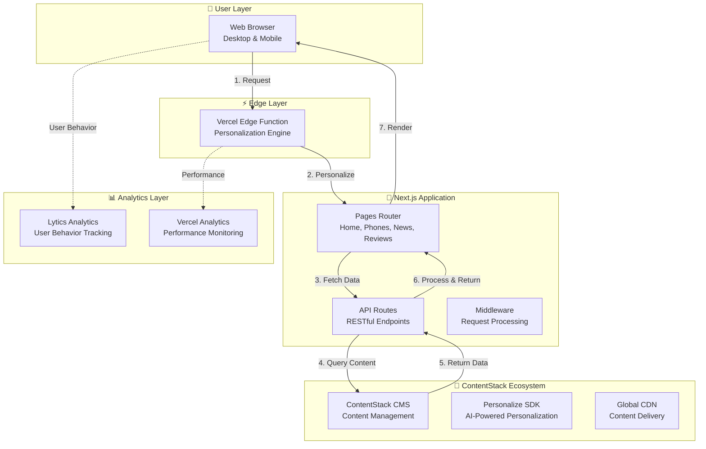
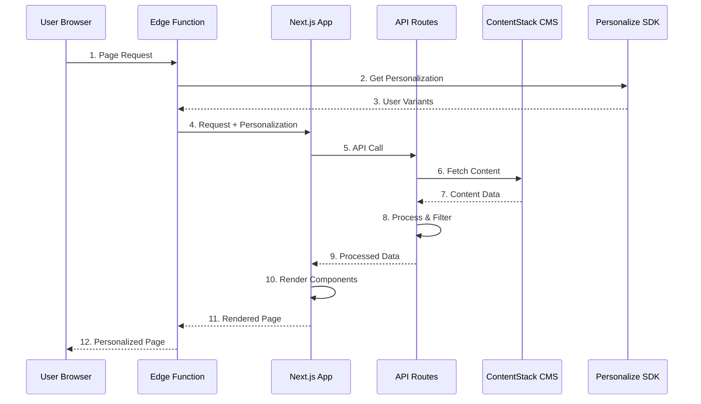

# 📱 PhoneFront - Comprehensive Project Documentation

## 🎯 **Project Overview**

**PhoneFront** is a modern, full-stack web application built for smartphone enthusiasts and consumers. It serves as a comprehensive platform for discovering, comparing, and learning about the latest smartphones, featuring detailed specifications, reviews, news, and company information.

### **Core Purpose**
- **Smartphone Discovery**: Browse and filter through extensive smartphone catalogs
- **Detailed Information**: Access comprehensive specifications, reviews, and news
- **Personalized Experience**: AI-powered content personalization based on user preferences
- **Company Insights**: Explore smartphone manufacturers and their product portfolios
- **User Engagement**: Interactive filtering, search, and content consumption

---

## 🏗️ **System Architecture**

### **High-Level Architecture**



### **Technology Stack**

| Layer | Technology | Purpose | Version |
|-------|------------|---------|---------|
| **Frontend** | Next.js 14 | React Framework | 14.2.16 |
| **Language** | TypeScript | Type Safety | ^5 |
| **Styling** | Tailwind CSS | Utility-first CSS | ^4.1.9 |
| **UI Components** | Radix UI | Accessible Components | Various |
| **State Management** | SWR | Data Fetching & Caching | latest |
| **Content Management** | ContentStack | Headless CMS | 4.4.3 |
| **Personalization** | ContentStack Personalize | AI Personalization | latest |
| **Analytics** | Lytics | User Behavior | - |
| **Deployment** | Vercel | Hosting & Edge Functions | - |
| **Testing** | Jest + Testing Library | Unit & Integration Tests | ^29.7.0 |

---

## 📁 **File Structure & Organization**

### **Root Directory Structure**

```
phonefront/
├── 📁 app/                    # Next.js App Router
├── 📁 components/             # React Components
├── 📁 lib/                    # Utility Libraries
├── 📁 hooks/                  # Custom React Hooks
├── 📁 public/                 # Static Assets
├── 📁 __tests__/              # Test Files
├── 📁 functions/              # Edge Functions
└── 📄 Configuration Files
```

### **Detailed File Structure**

#### **1. App Directory (`/app/`)**
```
app/
├── 📁 api/                    # API Routes
│   ├── phones/route.ts        # Phone data endpoint
│   ├── news/route.ts          # News data endpoint
│   ├── reviews/route.ts       # Reviews data endpoint
│   ├── companies/route.ts     # Company data endpoint
│   ├── price-filters/route.ts # Price filter data
│   └── ...                    # Other API endpoints
├── 📁 phones/                 # Phone pages
│   ├── page.tsx              # Phones listing page
│   └── [slug]/page.tsx       # Individual phone page
├── 📁 news/                   # News pages
├── 📁 reviews/                # Review pages
├── 📁 companies/              # Company pages
├── 📁 about/                  # About page
├── 📁 contact/                # Contact page
├── 📁 careers/                # Careers page
├── 📁 faqs/                   # FAQ page
├── layout.tsx                 # Root layout
├── page.tsx                   # Home page
└── globals.css                # Global styles
```

**Why this structure?**
- **App Router**: Next.js 13+ App Router provides better performance and developer experience
- **API Routes**: Co-located with pages for better organization
- **Dynamic Routes**: `[slug]` pattern for dynamic content pages
- **Layout System**: Nested layouts for consistent UI across pages

#### **2. Components Directory (`/components/`)**
```
components/
├── 📁 ui/                     # Reusable UI Components
│   ├── button.tsx            # Button component
│   ├── card.tsx              # Card component
│   ├── loader.tsx            # Loading animations
│   ├── select.tsx            # Select dropdown
│   └── ...                   # 50+ UI components
├── 📁 home/                   # Home page components
├── 📁 phones/                 # Phone-related components
├── 📁 news/                   # News-related components
├── 📁 reviews/                # Review-related components
├── 📁 companies/              # Company-related components
├── phone-card.tsx            # Phone card component
├── phone-filters.tsx         # Phone filtering component
├── site-header.tsx           # Site header
├── site-footer.tsx           # Site footer
└── ...                       # Other components
```

**Why this structure?**
- **UI Components**: Reusable, accessible components using Radix UI
- **Feature-based Organization**: Components grouped by feature/page
- **Separation of Concerns**: Clear distinction between UI and business logic
- **Scalability**: Easy to add new components and maintain existing ones

#### **3. Library Directory (`/lib/`)**
```
lib/
├── contentstack-delivery.ts   # ContentStack Delivery SDK
├── contentstack-management.ts # ContentStack Management SDK
├── contentstack-personalize.ts # Personalization SDK
├── fetcher.ts                # API fetching utilities
├── types.ts                  # TypeScript type definitions
├── utils.ts                  # General utilities
└── 📁 data/                  # Static data files
    ├── companies.ts          # Company data
    └── reviews.ts            # Review data
```

**Why this structure?**
- **SDK Integration**: Centralized ContentStack SDK configuration
- **Type Safety**: Comprehensive TypeScript definitions
- **Utility Functions**: Reusable helper functions
- **Data Management**: Static data and API utilities

---

## 🔧 **Core Technologies & Dependencies**

### **Frontend Framework: Next.js 14**

**Why Next.js?**
- **App Router**: Modern routing with better performance
- **Server-Side Rendering**: SEO-friendly content delivery
- **API Routes**: Full-stack capabilities in one framework
- **Edge Functions**: Global edge computing for personalization
- **Built-in Optimization**: Image optimization, code splitting, etc.

### **Content Management: ContentStack**

**Why ContentStack?**
- **Headless CMS**: Decoupled content and presentation
- **Personalization**: Built-in AI-powered content personalization
- **Global CDN**: Fast content delivery worldwide
- **Developer-Friendly**: Rich APIs and SDKs
- **Scalability**: Handles high traffic and content volume

**ContentStack Integration:**
```typescript
// Delivery SDK for fetching content
import { getAllEntries } from "@/lib/contentstack-delivery"

// Management SDK for content operations
import { createEntry } from "@/lib/contentstack-management"

// Personalize SDK for AI personalization
import Personalize from '@contentstack/personalize-edge-sdk'
```

### **State Management: SWR**

**Why SWR?**
- **Data Fetching**: Simple, efficient data fetching
- **Caching**: Automatic caching and revalidation
- **Real-time Updates**: Background revalidation
- **Error Handling**: Built-in error states
- **Performance**: Reduces unnecessary API calls

**SWR Implementation:**
```typescript
const { data, error, isLoading } = useSWR<ApiResponse>(
  url, 
  fetcher,
  { revalidateOnFocus: false }
)
```

### **UI Components: Radix UI + Tailwind CSS**

**Why Radix UI?**
- **Accessibility**: Built-in ARIA attributes and keyboard navigation
- **Customizable**: Unstyled components for design flexibility
- **TypeScript**: Full TypeScript support
- **Composition**: Flexible component composition patterns

**Why Tailwind CSS?**
- **Utility-First**: Rapid UI development
- **Consistency**: Design system enforcement
- **Performance**: Purged CSS for optimal bundle size
- **Responsive**: Mobile-first responsive design

### **Testing: Jest + Testing Library**

**Why this testing stack?**
- **Jest**: Fast, feature-rich testing framework
- **Testing Library**: User-centric testing approach
- **Coverage**: Comprehensive test coverage reporting
- **Integration**: Seamless Next.js integration

---

## 🚀 **Key Features & Functionality**

### **1. Smartphone Discovery & Filtering**

**Features:**
- Advanced filtering by price, brand, OS, features, etc.
- Real-time search functionality
- Dynamic price range filtering
- Multi-criteria filtering with URL persistence

**Implementation:**
```typescript
// Price filtering with Indian number format support
const parsePrice = (priceString: string): number => {
  const cleanPrice = priceString.replace(/[₹$€£,\s]/g, '').trim();
  return parseFloat(cleanPrice) || 0;
}
```

### **2. Content Personalization**

**Features:**
- AI-powered content recommendations
- User preference learning
- Personalized price ranges
- Dynamic content variants

**Implementation:**
```typescript
// Edge function personalization
const variantParam = searchParams.get(Personalize.VARIANT_QUERY_PARAM);
const personalizedContent = await query.variants(variantAlias).find();
```

### **3. Comprehensive Content Management**

**Content Types:**
- **Phones**: Detailed specifications, images, pricing
- **News**: Tech news and updates
- **Reviews**: Expert and user reviews
- **Companies**: Manufacturer information
- **Pages**: Static content (About, Contact, etc.)

### **4. Performance Optimization**

**Optimizations:**
- Server-side rendering for SEO
- Image optimization with Next.js
- SWR caching for data fetching
- Edge functions for global performance
- Code splitting and lazy loading

---

## 🔄 **Data Flow Architecture**

### **Request Flow**



### **Personalization Flow**

1. **User Request**: Browser sends request with cookies
2. **Edge Processing**: Vercel Edge Function processes personalization
3. **Variant Selection**: ContentStack Personalize selects content variants
4. **Content Fetching**: API routes fetch personalized content
5. **Data Processing**: Content is processed and filtered
6. **Response**: Personalized content is returned to user

---

## 🧪 **Testing Strategy**

### **Test Coverage**

```
Test Types:
├── Unit Tests (Components)
├── Integration Tests (API Routes)
├── E2E Tests (User Flows)
└── Performance Tests (Load Testing)
```

### **Testing Implementation**

```typescript
// Component Testing Example
describe('PhoneCard Component', () => {
  it('renders phone information correctly', () => {
    render(<PhoneCard phone={mockPhone} />);
    expect(screen.getByText(mockPhone.name)).toBeInTheDocument();
  });
});

// API Testing Example
describe('Phones API', () => {
  it('returns phones data', async () => {
    const response = await GET(new Request('/api/phones'));
    expect(response.status).toBe(200);
  });
});
```

---

## 🚀 **Deployment & Infrastructure**

### **Deployment Platform: Vercel**

**Why Vercel?**
- **Edge Functions**: Global edge computing
- **Automatic Scaling**: Handles traffic spikes
- **Git Integration**: Automatic deployments
- **Performance**: Optimized for Next.js
- **Analytics**: Built-in performance monitoring

### **Environment Configuration**

```typescript
// Environment Variables
NEXT_PUBLIC_CONTENTSTACK_API_KEY=your_api_key
NEXT_PUBLIC_CONTENTSTACK_DELIVERY_TOKEN=your_token
NEXT_PUBLIC_CONTENTSTACK_ENVIRONMENT=dev
NEXT_PUBLIC_CONTENTSTACK_REGION=us
```

---

## 📊 **Analytics & Monitoring**

### **Analytics Stack**

1. **Lytics Analytics**
   - User behavior tracking
   - Personalization metrics
   - Content engagement analytics

2. **Vercel Analytics**
   - Performance monitoring
   - Core Web Vitals
   - Real-time metrics

3. **Custom Analytics**
   - Impression tracking
   - Filter usage analytics
   - User journey mapping

---

## 🔧 **Development Workflow**

### **Development Commands**

```bash
# Development
npm run dev          # Start development server
npm run build        # Build for production
npm run start        # Start production server

# Testing
npm run test         # Run tests in watch mode
npm run test:ci      # Run tests for CI
npm run test:coverage # Run tests with coverage

# Linting
npm run lint         # Run ESLint
```

### **Code Quality Standards**

- **TypeScript**: Strict type checking
- **ESLint**: Code quality enforcement
- **Prettier**: Code formatting
- **Husky**: Git hooks for quality checks
- **Testing**: Comprehensive test coverage

---

## 🎨 **Design System**

### **UI Component Library**

**Component Categories:**
- **Layout**: Containers, grids, spacing
- **Navigation**: Headers, menus, breadcrumbs
- **Forms**: Inputs, selects, buttons
- **Data Display**: Cards, tables, lists
- **Feedback**: Loaders, toasts, alerts
- **Media**: Images, videos, carousels

### **Design Principles**

1. **Accessibility First**: WCAG 2.1 AA compliance
2. **Mobile-First**: Responsive design approach
3. **Performance**: Optimized for speed
4. **Consistency**: Unified design language
5. **Scalability**: Reusable component system

---

## 🔮 **Future Enhancements**

### **Planned Features**

1. **Advanced Personalization**
   - Machine learning recommendations
   - User preference learning
   - Dynamic content optimization

2. **Enhanced User Experience**
   - Progressive Web App (PWA)
   - Offline functionality
   - Push notifications

3. **Content Expansion**
   - Video reviews
   - Comparison tools
   - User-generated content

4. **Performance Improvements**
   - Advanced caching strategies
   - CDN optimization
   - Bundle size reduction

---

## 📚 **API Documentation**

### **Core API Endpoints**

| Endpoint | Method | Purpose | Parameters |
|----------|--------|---------|------------|
| `/api/phones` | GET | Fetch phones with filtering | `page`, `pageSize`, `sortBy`, `companies`, `os`, `features`, `priceRange` |
| `/api/news` | GET | Fetch news articles | `page`, `pageSize`, `sortBy`, `categories` |
| `/api/reviews` | GET | Fetch phone reviews | `page`, `pageSize`, `sortBy`, `phoneId` |
| `/api/companies` | GET | Fetch company data | `page`, `pageSize` |
| `/api/price-filters` | GET | Fetch price filter ranges | - |
| `/api/feedback` | POST | Submit user feedback | `name`, `email`, `message` |

### **Response Format**

```typescript
interface ApiResponse<T> {
  items: T[];
  page: number;
  pageSize: number;
  total: number;
  personalized: boolean;
  variantParam?: string;
}
```

---

## 🛠️ **Troubleshooting & Maintenance**

### **Common Issues**

1. **Price Filtering Issues**
   - Ensure proper currency parsing
   - Check price range configurations
   - Verify ContentStack data format

2. **Personalization Problems**
   - Check edge function configuration
   - Verify ContentStack Personalize setup
   - Debug variant parameter passing

3. **Performance Issues**
   - Monitor Core Web Vitals
   - Check API response times
   - Optimize image loading

### **Maintenance Tasks**

- **Regular Updates**: Keep dependencies updated
- **Content Management**: Monitor ContentStack content
- **Performance Monitoring**: Track analytics and metrics
- **Security Updates**: Apply security patches
- **Backup Strategy**: Regular data backups

---

## 📞 **Support & Contact**

For technical support, feature requests, or questions about this project:

- **Documentation**: This comprehensive guide
- **Code Comments**: Inline code documentation
- **Issue Tracking**: GitHub issues for bug reports
- **Development Team**: Internal development team

---

*This documentation is maintained and updated regularly to reflect the current state of the PhoneFront project.*
